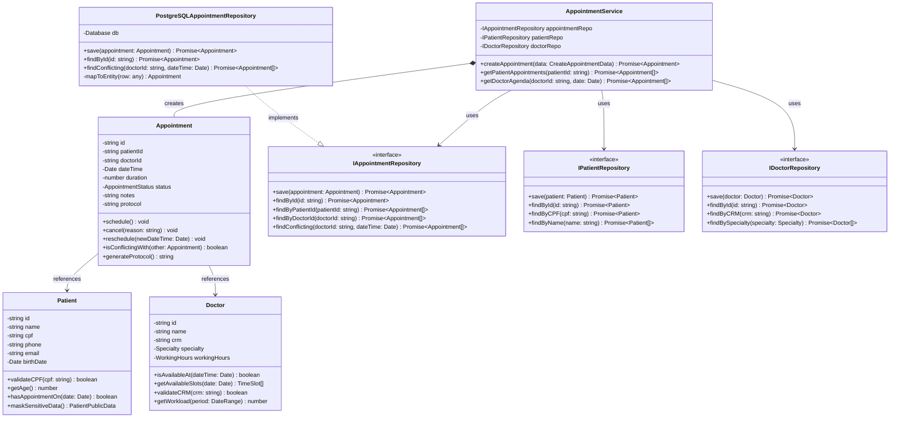

# Projeto Detalhado - Classes Principais do Módulo de Agendamento

**Versão**: 1.0  
**Data**: 27/01/2024  
**Desenvolvedor**: Desenvolvedor Senior  
**Status**: Aprovado para Implementação

---

## 📋 Classes Principais do Módulo de Agendamento

### **1. 📅 Classe Appointment (Consulta)**

#### **Responsabilidade Principal (T9)**
Gerenciar o ciclo de vida de uma consulta médica, incluindo criação, validação de regras de negócio, mudanças de status e cálculo de disponibilidade.

#### **Estrutura da Classe**
```typescript
class Appointment {
  private id: string
  private patientId: string
  private doctorId: string
  private dateTime: Date
  private duration: number
  private status: AppointmentStatus
  private notes: string
  private priority: Priority
  private protocol: string
  private createdAt: Date
  private updatedAt: Date

  constructor(data: CreateAppointmentData) {
    this.validateBusinessRules(data)
    this.id = this.generateId()
    this.protocol = this.generateProtocol()
    this.status = AppointmentStatus.SCHEDULED
    this.createdAt = new Date()
    // ... assign other properties
  }

  // Métodos de negócio
  public schedule(): void
  public cancel(reason: string): void
  public reschedule(newDateTime: Date): void
  public complete(): void
  public isConflictingWith(other: Appointment): boolean
  public canBeCancelled(): boolean
  public generateProtocol(): string
  private validateBusinessRules(data: CreateAppointmentData): void
}

enum AppointmentStatus {
  SCHEDULED = 'scheduled',
  CONFIRMED = 'confirmed',
  IN_PROGRESS = 'in_progress',
  COMPLETED = 'completed',
  CANCELLED = 'cancelled',
  NO_SHOW = 'no_show'
}
```

---

### **2. 👨⚕️ Classe Doctor (Médico)**

#### **Responsabilidade Principal (T9)**
Representar um médico no sistema, gerenciar sua agenda, especialidades e disponibilidade para consultas.

#### **Estrutura da Classe**
```typescript
class Doctor {
  private id: string
  private name: string
  private crm: string
  private specialty: Specialty
  private phone: string
  private email: string
  private workingHours: WorkingHours
  private isActive: boolean

  constructor(data: CreateDoctorData) {
    this.validateCRM(data.crm)
    this.id = this.generateId()
    // ... assign properties
  }

  // Métodos de negócio
  public isAvailableAt(dateTime: Date): boolean
  public getAvailableSlots(date: Date): TimeSlot[]
  public addWorkingHours(hours: WorkingHours): void
  public blockTimeSlot(start: Date, end: Date): void
  public validateCRM(crm: string): boolean
  public getWorkload(period: DateRange): number
}

interface WorkingHours {
  dayOfWeek: number
  startTime: string
  endTime: string
  breakStart?: string
  breakEnd?: string
}
```

---

### **3. 👤 Classe Patient (Paciente)**

#### **Responsabilidade Principal (T9)**
Representar um paciente no sistema, gerenciar seus dados pessoais, histórico de consultas e validações de dados sensíveis.

#### **Estrutura da Classe**
```typescript
class Patient {
  private id: string
  private name: string
  private cpf: string
  private phone: string
  private email: string
  private birthDate: Date
  private address: Address
  private isActive: boolean
  private createdAt: Date

  constructor(data: CreatePatientData) {
    this.validateCPF(data.cpf)
    this.id = this.generateId()
    this.createdAt = new Date()
    // ... assign properties
  }

  // Métodos de negócio
  public validateCPF(cpf: string): boolean
  public getAge(): number
  public hasAppointmentOn(date: Date): boolean
  public getAppointmentHistory(): Appointment[]
  public updateContactInfo(phone: string, email: string): void
  public maskSensitiveData(): PatientPublicData
}

interface Address {
  street: string
  number: string
  city: string
  state: string
  zipCode: string
}
```

---

## 🔗 Baixo Acoplamento através de Interfaces (T11)

### **Como as Interfaces Garantem Baixo Acoplamento**

#### **1. Interface de Comunicação entre Classes**
```typescript
// Interface para Patient Service
interface IPatientService {
  findById(id: string): Promise<Patient | null>
  findByCPF(cpf: string): Promise<Patient | null>
  validateExists(id: string): Promise<boolean>
}

// Interface para Doctor Service  
interface IDoctorService {
  findById(id: string): Promise<Doctor | null>
  checkAvailability(doctorId: string, dateTime: Date): Promise<boolean>
  getAvailableSlots(doctorId: string, date: Date): Promise<TimeSlot[]>
}

// Appointment Service usa interfaces, não implementações concretas
class AppointmentService {
  constructor(
    private patientService: IPatientService,  // Interface, não classe concreta
    private doctorService: IDoctorService,    // Interface, não classe concreta
    private appointmentRepository: IAppointmentRepository
  ) {}

  async createAppointment(data: CreateAppointmentData): Promise<Appointment> {
    // Usa interface - baixo acoplamento
    const patient = await this.patientService.findById(data.patientId)
    const doctor = await this.doctorService.findById(data.doctorId)
    
    if (!patient || !doctor) {
      throw new Error('Patient or Doctor not found')
    }

    const appointment = new Appointment({
      ...data,
      patient,
      doctor
    })

    return await this.appointmentRepository.save(appointment)
  }
}
```

#### **2. Benefícios do Baixo Acoplamento**
- **Testabilidade**: Fácil criação de mocks para testes unitários
- **Flexibilidade**: Troca de implementações sem afetar outras classes
- **Manutenibilidade**: Mudanças em uma classe não afetam outras
- **Reutilização**: Interfaces podem ser implementadas por diferentes classes

---

## 💾 Padrão Repository para Persistência (T8)

### **Como o Repository Pattern é Aplicado**

#### **1. Interface do Repository**
```typescript
// Interface genérica para Repository
interface IRepository<T> {
  save(entity: T): Promise<T>
  findById(id: string): Promise<T | null>
  findAll(): Promise<T[]>
  update(id: string, data: Partial<T>): Promise<T>
  delete(id: string): Promise<void>
}

// Repository específico para Appointment
interface IAppointmentRepository extends IRepository<Appointment> {
  findByPatientId(patientId: string): Promise<Appointment[]>
  findByDoctorId(doctorId: string): Promise<Appointment[]>
  findByDateRange(start: Date, end: Date): Promise<Appointment[]>
  findConflicting(doctorId: string, dateTime: Date): Promise<Appointment[]>
  findByStatus(status: AppointmentStatus): Promise<Appointment[]>
}

// Repository específico para Patient
interface IPatientRepository extends IRepository<Patient> {
  findByCPF(cpf: string): Promise<Patient | null>
  findByName(name: string): Promise<Patient[]>
  findByPhone(phone: string): Promise<Patient | null>
}

// Repository específico para Doctor
interface IDoctorRepository extends IRepository<Doctor> {
  findByCRM(crm: string): Promise<Doctor | null>
  findBySpecialty(specialty: Specialty): Promise<Doctor[]>
  findAvailableAt(dateTime: Date): Promise<Doctor[]>
}
```

#### **2. Implementação Concreta do Repository**
```typescript
// Implementação para PostgreSQL
class PostgreSQLAppointmentRepository implements IAppointmentRepository {
  constructor(private db: Database) {}

  async save(appointment: Appointment): Promise<Appointment> {
    const query = `
      INSERT INTO appointments (id, patient_id, doctor_id, date_time, duration, status, notes, protocol)
      VALUES ($1, $2, $3, $4, $5, $6, $7, $8)
      RETURNING *
    `
    const result = await this.db.query(query, [
      appointment.getId(),
      appointment.getPatientId(),
      appointment.getDoctorId(),
      appointment.getDateTime(),
      appointment.getDuration(),
      appointment.getStatus(),
      appointment.getNotes(),
      appointment.getProtocol()
    ])
    
    return this.mapToEntity(result.rows[0])
  }

  async findById(id: string): Promise<Appointment | null> {
    const query = 'SELECT * FROM appointments WHERE id = $1'
    const result = await this.db.query(query, [id])
    
    return result.rows.length > 0 ? this.mapToEntity(result.rows[0]) : null
  }

  async findConflicting(doctorId: string, dateTime: Date): Promise<Appointment[]> {
    const query = `
      SELECT * FROM appointments 
      WHERE doctor_id = $1 
      AND date_time = $2 
      AND status IN ('scheduled', 'confirmed')
    `
    const result = await this.db.query(query, [doctorId, dateTime])
    
    return result.rows.map(row => this.mapToEntity(row))
  }

  private mapToEntity(row: any): Appointment {
    // Mapear dados do banco para entidade
    return new Appointment({
      id: row.id,
      patientId: row.patient_id,
      doctorId: row.doctor_id,
      dateTime: row.date_time,
      duration: row.duration,
      status: row.status,
      notes: row.notes,
      protocol: row.protocol
    })
  }
}
```

#### **3. Uso do Repository no Service**
```typescript
class AppointmentService {
  constructor(
    private appointmentRepository: IAppointmentRepository,
    private patientRepository: IPatientRepository,
    private doctorRepository: IDoctorRepository
  ) {}

  async createAppointment(data: CreateAppointmentData): Promise<Appointment> {
    // 1. Validar existência de paciente e médico
    const [patient, doctor] = await Promise.all([
      this.patientRepository.findById(data.patientId),
      this.doctorRepository.findById(data.doctorId)
    ])

    if (!patient || !doctor) {
      throw new Error('Patient or Doctor not found')
    }

    // 2. Verificar conflitos
    const conflicts = await this.appointmentRepository.findConflicting(
      data.doctorId, 
      data.dateTime
    )

    if (conflicts.length > 0) {
      throw new Error('Time slot not available')
    }

    // 3. Criar e salvar appointment
    const appointment = new Appointment(data)
    return await this.appointmentRepository.save(appointment)
  }

  async getPatientAppointments(patientId: string): Promise<Appointment[]> {
    return await this.appointmentRepository.findByPatientId(patientId)
  }

  async getDoctorAgenda(doctorId: string, date: Date): Promise<Appointment[]> {
    const startOfDay = new Date(date.setHours(0, 0, 0, 0))
    const endOfDay = new Date(date.setHours(23, 59, 59, 999))
    
    const appointments = await this.appointmentRepository.findByDateRange(
      startOfDay, 
      endOfDay
    )
    
    return appointments.filter(apt => apt.getDoctorId() === doctorId)
  }
}
```

#### **4. Benefícios do Repository Pattern**
- **Abstração**: Service não conhece detalhes de persistência
- **Testabilidade**: Fácil criação de repositórios mock para testes
- **Flexibilidade**: Troca de banco de dados sem afetar lógica de negócio
- **Centralização**: Todas as queries ficam centralizadas no repository
- **Reutilização**: Queries podem ser reutilizadas por diferentes services

---

## 🔄 Diagrama de Classes (Mermaid)



---

## 📊 Resumo dos Padrões Aplicados

### **1. Single Responsibility Principle (SRP)**
- **Appointment**: Gerencia apenas lógica de consultas
- **Patient**: Gerencia apenas dados de pacientes  
- **Doctor**: Gerencia apenas dados de médicos

### **2. Repository Pattern**
- **Abstração**: Interfaces separam lógica de negócio da persistência
- **Flexibilidade**: Permite troca de banco de dados
- **Testabilidade**: Facilita criação de mocks

### **3. Dependency Injection**
- **Baixo Acoplamento**: Services dependem de interfaces, não implementações
- **Flexibilidade**: Fácil troca de implementações
- **Testabilidade**: Injeção de mocks para testes

### **4. Factory Pattern (Implícito)**
- **Appointment**: Constructor atua como factory com validações
- **Protocol Generation**: Método factory para gerar protocolos únicos

---

**Documento aprovado por**: Desenvolvedor Senior  
**Data de aprovação**: 27/01/2024  
**Próxima revisão**: Após implementação das classes base