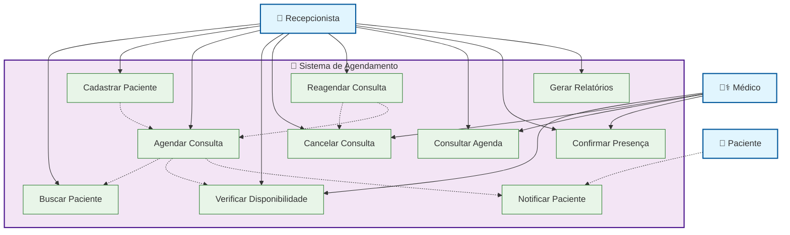
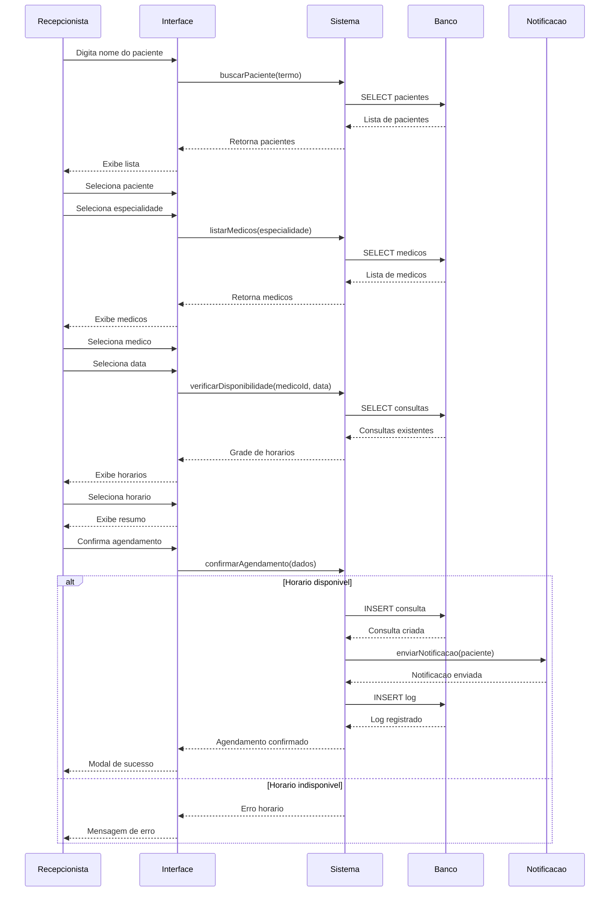
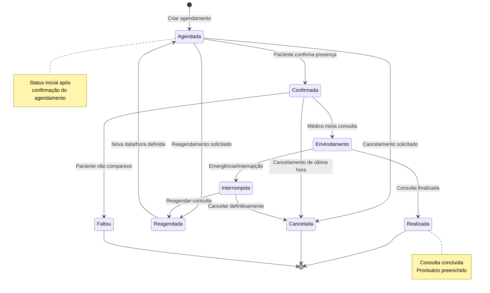

# Diagramas UML - Módulo Agendamento de Consultas (Corrigido)

## 1. Diagrama de Caso de Uso

## 2. Diagrama de Sequência - Realizar Agendamento

## 3. Diagrama de Atividades - Processo de Agendamento

```mermaid
flowchart TD
    Start([🚀 Iniciar Agendamento]) --> SearchPatient[🔍 Buscar Paciente]
    
    SearchPatient --> PatientFound{Paciente Encontrado?}
    PatientFound -->|Não| CreatePatient[➕ Cadastrar Novo Paciente]
    PatientFound -->|Sim| SelectPatient[✅ Selecionar Paciente]
    CreatePatient --> SelectPatient
    
    SelectPatient --> FilterSpecialty[🏥 Filtrar Especialidade]
    FilterSpecialty --> SelectDoctor[👨⚕️ Selecionar Médico]
    
    SelectDoctor --> SelectDate[📅 Selecionar Data]
    SelectDate --> ValidateDate{Data Válida?}
    ValidateDate -->|Não| SelectDate
    ValidateDate -->|Sim| LoadSchedule[⏰ Carregar Grade de Horários]
    
    LoadSchedule --> SelectTime[🕐 Selecionar Horário]
    SelectTime --> ShowSummary[📋 Exibir Resumo]
    
    ShowSummary --> ConfirmBooking[✅ Confirmar Agendamento]
    ConfirmBooking --> ValidateAvailability{Horário Ainda Disponível?}
    
    ValidateAvailability -->|Não| ShowError[❌ Exibir Erro]
    ShowError --> LoadSchedule
    
    ValidateAvailability -->|Sim| CreateAppointment[💾 Criar Consulta]
    CreateAppointment --> GenerateProtocol[🔢 Gerar Protocolo]
    GenerateProtocol --> SendNotification[📧 Enviar Notificação]
    SendNotification --> LogActivity[📝 Registrar Log]
    LogActivity --> ShowSuccess[🎉 Exibir Sucesso]
    ShowSuccess --> End([✨ Fim])
    
    %% Estilos
    classDef startEnd fill:#4caf50,stroke:#2e7d32,stroke-width:2px,color:#fff
    classDef process fill:#2196f3,stroke:#1565c0,stroke-width:2px,color:#fff
    classDef decision fill:#ff9800,stroke:#ef6c00,stroke-width:2px,color:#fff
    classDef error fill:#f44336,stroke:#c62828,stroke-width:2px,color:#fff
    
    class Start,End startEnd
    class SearchPatient,CreatePatient,SelectPatient,FilterSpecialty,SelectDoctor,SelectDate,LoadSchedule,SelectTime,ShowSummary,ConfirmBooking,CreateAppointment,GenerateProtocol,SendNotification,LogActivity,ShowSuccess process
    class PatientFound,ValidateDate,ValidateAvailability decision
    class ShowError error
```

## 4. Diagrama de Estados - Consulta

## 5. Notas de Implementação

### Casos de Uso Principais:
- **UC3 - Agendar Consulta**: Caso de uso central que orquestra todo o processo
- **UC4 - Verificar Disponibilidade**: Essencial para evitar conflitos
- **UC10 - Notificar Paciente**: Automatização importante para experiência do usuário

### Fluxo de Sequência:
1. **Busca de Paciente**: Validação e seleção
2. **Seleção de Médico**: Filtros por especialidade
3. **Escolha de Data/Hora**: Verificação de disponibilidade em tempo real
4. **Confirmação**: Validação final e persistência
5. **Notificação**: Comunicação automática com paciente

### Estados da Consulta:
- **Agendada**: Estado inicial após confirmação
- **Confirmada**: Paciente confirmou presença
- **Realizada**: Consulta concluída com sucesso
- **Cancelada**: Cancelamento por qualquer motivo
- **Faltou**: Paciente não compareceu

### Validações Críticas:
- Verificação de disponibilidade antes da confirmação
- Validação de regras de negócio (horário de funcionamento)
- Controle de concorrência para evitar duplo agendamento